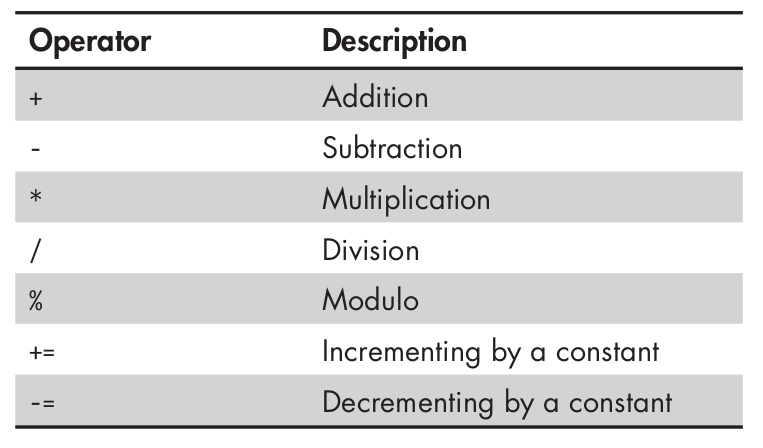
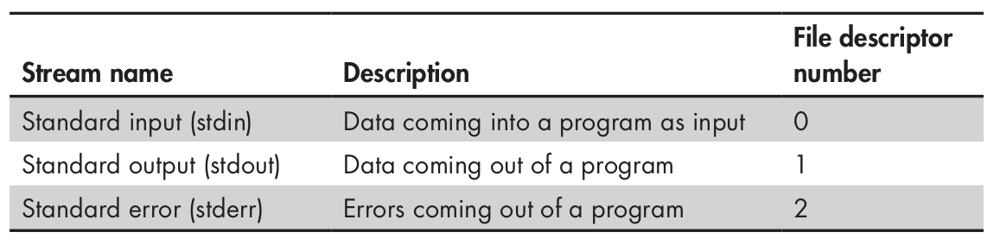
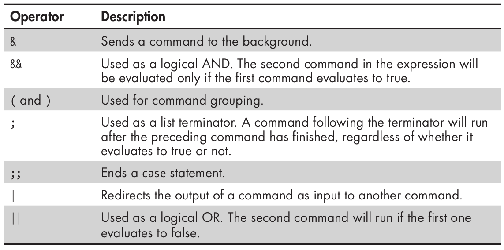
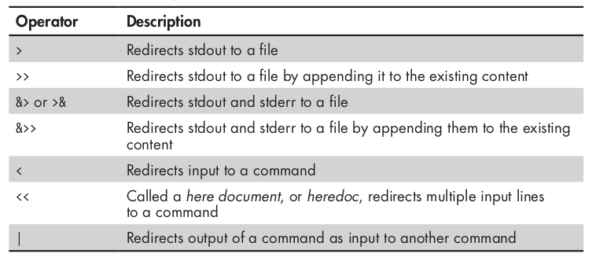

### basics
```bash
bash --version

# ans
GNU bash, version 5.2.15(1)-release (x86_64-pc-linux-gnu)
Copyright (C) 2022 Free Software Foundation, Inc.
License GPLv3+: GNU GPL version 3 or later <http://gnu.org/licenses/gpl.html>

This is free software; you are free to change and redistribute it.
There is NO WARRANTY, to the extent permitted by law.

env
echo $SHELL

#!/bin/bash -x Prints all commands and their arguments as they are executed to the terminal (useful for debugging)

#!/bin/bash -r REstricted bash shell

# Comments

# first shell
#!/bin/bash

echo "Hello world"

chmod +x hello.sh
./hello.sh

# Debugging
bash -n script.sh # only reads without executing

sh -x script.sh # show commands executed

#!/bin/bash
set -x # set debugging mode at this point

--snip--

set +x # disables debugging mode


```
### variables
```bash
book="black hat bash"
echo "This book's name is ${book}"

# ans
# This book's name is black hat bash

root_directory=$(ls -ld /)
echo "${root_directory}"

# ans
drwxr-xr-x 1 root root 250 Aug 12 17:45 /

```

### Unassinging variables
```bash
book="Black Hat Bash"
unset book
echo "${book}"

```

### Scoping variables
```bash
# name is a local variable
# PUBLISHER is a global variable


```

### Arithmetic Operators

```bash


```

### Arrays
```bash


```
### Streams


### Control Operators

```bash

touch test && touch test123
(ls;ps)
ls;ps;whoami
lzl || echo "the lzl command filed"

```
### Redirector Operations

```bash
# Redirects the standar output stream to a file
echo "i dont make mistakes" > output.txt

# Append content
echo "im not just like the rest of you" >> output.txt

# Send screen output into a file
ls -l / &> stdout_and_stderr.txt

# Send standard output into a file and standard error into another
ls -l / 1> stdout.txt 2> stderr.txt

# standard input (supplies txt into input commands)
cat < output.txt

# Send multiple lines like standard input of a command
cat << EOF
im stronger im smarter
im better
i am better
EOF

# Redirects output of a command and sending it like input to another
ls -l / | grep "bin"
```
### Positional Arguments
```bash
echo "The arguments are: $@"
echo "The total number of arguments is: $#"

```
### Input prompting
```bash


```
