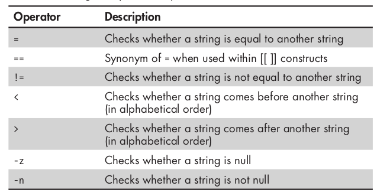

### File test Operators


### String comparison operators


### Integer comparison operators


### If
```bash
if [[ condition ]]; then
    # code to be executed if condition is true
elif [[ another_condition ]]; then
    # code to be executed if another_condition is true
else
    # code to be executed if none of the above conditions are true
fi

```

